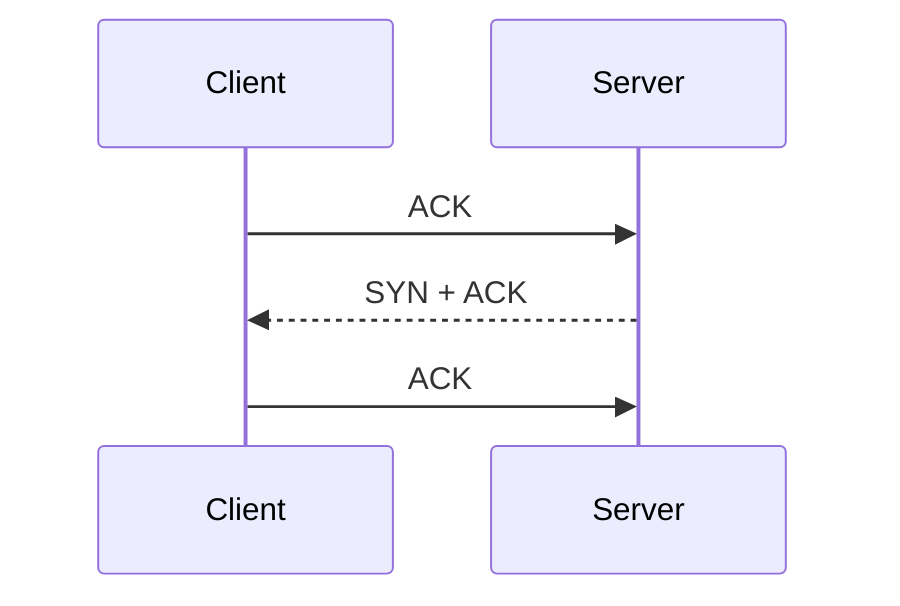

# 2014-11-16 - TRAFFIC ANALYSIS EXERCISE
## QUESTIONS
### LEVEL 1 QUESTIONS:
1) What is the IP address of the Windows VM that gets infected?

第一個封包為 TCP SYN+ACK 封包。
網路層來看：
- Source：204.79.197.200
- Destination：172.16.165.165
那是誰發起的呢？往下看三項交握原理


從圖得知　172.16.165.165 為發起的 Client 端。

[three-way-handshake](https://notfalse.net/7/three-way-handshake)

2) What is the host name of the Windows VM that gets infected?
先以 Statistics -> Protocol Hierarchy 得知有哪些協定，從這協定中可以發現 `DHCP` 與 `NBNS` 可以獲取 hostname。
透過 [NBNS protocol](https://wiki.wireshark.org/NetBIOS/NBNS) 可得知。
在 display filter 輸入 **nbns**。
以下為第 2408 個封包：
```bash
NetBIOS Name Service
    Transaction ID: 0x8045
    Flags: 0x4000, Opcode: Refresh
        0... .... .... .... = Response: Message is a query
        .100 0... .... .... = Opcode: Refresh (8)
        .... ..0. .... .... = Truncated: Message is not truncated
        .... ...0 .... .... = Recursion desired: Don't do query recursively
        .... .... ...0 .... = Broadcast: Not a broadcast packet
    Questions: 1
    Answer RRs: 0
    Authority RRs: 0
    Additional RRs: 1
    Queries
        K34EN6W3N-PC<00>: type NB, class IN
            Name: K34EN6W3N-PC<00> (Workstation/Redirector)
            Type: NB (32)
            Class: IN (1)
    Additional records
        K34EN6W3N-PC<00>: type NB, class IN
            Name: K34EN6W3N-PC<00> (Workstation/Redirector)
            Type: NB (32)
            Class: IN (1)
            Time to live: 3 days, 11 hours, 20 minutes
            Data length: 6
            Name flags: 0x6000, ONT: Unknown (H-node, unique)
                0... .... .... .... = Name type: Unique name
                .11. .... .... .... = ONT: Unknown (3)
            Addr: 172.16.165.165

```
其中 **K34EN6W3N-PC** 為 172.16.165.165 的 hostname。
又或者從 dhcp 也可以看出 hostname。
display filter 輸入 **bootp.option.hostname**

[WINS 介紹](https://www.wikiwand.com/zh-tw/WINS)
[nbns 語法](https://www.wireshark.org/docs/dfref/n/nbns.html)
[dhcp protocol](http://www.netadmin.com.tw/article_content.aspx?sn=1312090004&jump=4)
[dhcp](https://wiki.wireshark.org/DHCP)
[dhcp 語法](https://www.wireshark.org/docs/dfref/b/bootp.html)
[dhcp v6](http://www.netadmin.com.tw/article_content.aspx?sn=1506290006&jump=1)
3) What is the MAC address of the infected VM?
從上述的 bootp.option.hostname 中可查看到第 2442 封包中的 **Option: (61) Client identifier**
```bash
Client MAC address: f0:19:af:02:9b:f1 (f0:19:af:02:9b:f1)
```
即可知道 **f0:19:af:02:9b:f1** 為 172.16.165.165 的主機 MAC

4) What is the IP address of the compromised web site?

5) What is the domain name of the compromised web site?

6) What is the IP address and domain name that delivered the exploit kit and malware?

7) What is the domain name that delivered the exploit kit and malware?


### LEVEL 2 QUESTIONS:
1) What is the redirect URL that points to the exploit kit (EK) landing page?
2) Besided the landing page (which contains the CVE-2013-2551 IE exploit), what other exploit(s) sent by the EK?
4) How many times was the payload delivered?
5) Submit the pcap to VirusTotal and find out what snort alerts triggered.  What are the EK names are shown in the Suricata alerts?
 

### LEVEL 3 QUESTIONS:
1) Checking my website, what have I (and others) been calling this exploit kit?
2) What file or page from the compromised website has the malicious script with the URL for the redirect?
3) Extract the exploit file(s).  What is(are) the md5 file hash(es)?
4) VirusTotal doesn't show all the VRT rules under the "Snort alerts" section for the pcap analysis.  If you run your own version of Snort with the VRT ruleset as a registered user (or a subscriber), what VRT rules fire?
